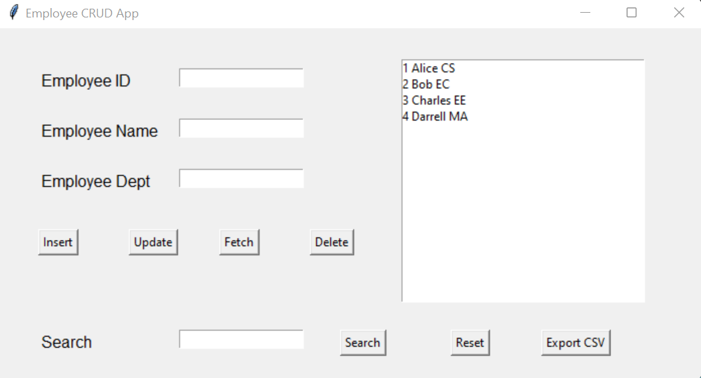

# Employee CRUD GUI Application

A desktop application for managing employee records with a graphical user interface (GUI) built using Tkinter and a MySQL database backend.

---

## Features

- Add, update, delete, and fetch employee records
- Search employee by name or department
- Export all employee data to CSV
- User login authentication (with dummy credentials)
- Clean, spaced-out GUI layout

---

## Screenshot



---

## Requirements

- Python 3.x
- MySQL server
- Python packages:
  - `mysql-connector-python`
  - `tkinter` (usually included with Python)
  - `re` (standard library)
  - `csv` (standard library)

---

## Setup

### 1. Clone the Repository

`git clone https://github.com/ada2804/CRUD-GUI.git`  
`cd CRUD-GUI`


### 2. Set Up a Virtual Environment (Recommended)

`python -m venv venv`


**Activate the virtual environment:**

- On Windows:  
`venv\Scripts\activate`

- On Mac/Linux:  
`source venv/bin/activate`


### 3. Install Dependencies

`pip install -r requirements.txt`


### 4. Set Up the MySQL Database

- Start your MySQL server.
- Run the following SQL commands in your MySQL client:

```sql
CREATE DATABASE employee;  
USE employee;  
CREATE TABLE empDetails (  
empID INT PRIMARY KEY,  
empName VARCHAR(255) NOT NULL,  
empDept VARCHAR(255) NOT NULL  
);
```

### 5. Configure Database Credentials

- Copy `config.example.py` to `config.py`:

`cp config.example.py config.py`

- Edit `config.py` and enter your own MySQL username and password.

**Note:**  
Your `config.py` file should look like this:

```python
DB_CONFIG = {
'host': 'localhost',
'user': 'your_mysql_username',
'password': 'your_mysql_password',
'database': 'employee',
'auth_plugin': 'mysql_native_password'
}

APP_CREDENTIALS = {
'username': 'admin',
'password': 'password'
}
```

*Never commit your real `config.py` to the repository. It is already included in `.gitignore`.*

---

## Running the Application

`python app.py`

---

## Login Credentials

When you run the application, use the following credentials to log in:

- **Username:** admin
- **Password:** password

If you want to change these credentials, edit the `APP_CREDENTIALS` in your local `config.py` file.

---

## Usage

- Use the GUI to add, update, delete, search, and export employee records.
- The "Reset" and "Export CSV" buttons are located below the employee list.

---

## Project Structure

- `app.py` – Main GUI application
- `employee_db.py` – Database handler class
- `config.example.py` – Example configuration file
- `config.py` – Your actual configuration (not tracked by git)
- `requirements.txt` – Python dependencies
- `.gitignore` – Files/folders to ignore in git
- `CRUD-SS.png` – Application screenshot

---

## Security Note

- Never share your `config.py` or database credentials publicly.
- Always keep sensitive files in `.gitignore`.

---

## License

This project is for educational purposes.

---

*Developed with ❤️ using Python and Tkinter.*